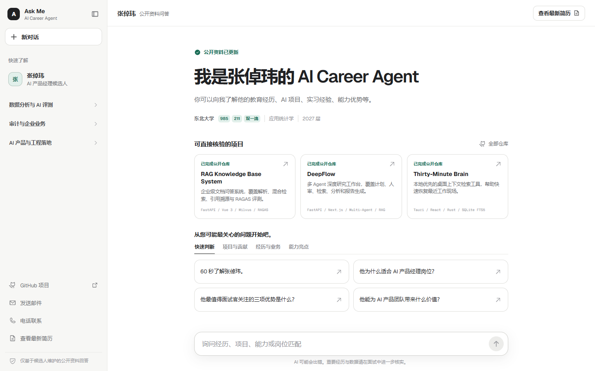
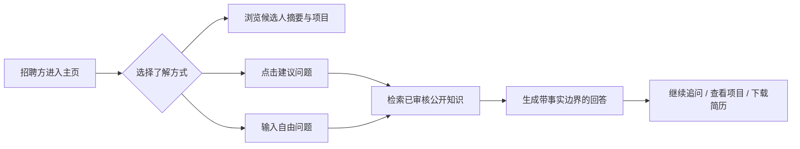

# Ask Me

张倬玮的 AI Career Agent。它面向 AI 产品招聘经理和业务面试官，通过静态摘要、可追问对话、事实来源与能力边界，帮助招聘方快速获得可验证的候选人信息。

在线演示：[ask-me-career-agent.vercel.app](https://ask-me-career-agent.vercel.app)。Production 使用 DeepSeek 官方 API、Upstash、Neon 与 Vercel Blob；最新版简历始终通过 `/resume` 访问。

## 产品预览



首页把候选人摘要、可验证项目、建议问题和追问对话放在同一界面中，让招聘方先快速判断，再按兴趣深入核验。

## 核心能力

- 将教育、项目、审计经历和能力边界整理为招聘方可快速浏览的公开资料。
- 通过预设问题和自由追问降低了解候选人的沟通成本。
- 回答只使用已审核的公开知识，并保留 Claim-Source 对应关系。
- 支持无模型密钥的本地演示模式，以及服务端 DeepSeek 生产模式。
- 使用请求预算、跨实例限流、匿名事件记录和紧急开关控制线上风险。
- 简历通过稳定的 `/resume` 入口交付，文件版本由 Vercel Blob 管理。

## 产品流程



## 系统架构

```mermaid
flowchart TB
    Browser[Next.js 招聘方界面] --> ChatAPI[/api/chat 服务端路由]
    Browser --> Resume[/resume 稳定入口]

    ChatAPI --> Budget[请求与 Token 预算]
    Budget --> RateLimit[Upstash 跨实例限流]
    RateLimit --> Retrieval[公开知识检索]
    Retrieval --> Content[content/ + Zod 校验<br/>Claim-Source 审核]
    Retrieval --> DeepSeek[DeepSeek 服务端推理]
    DeepSeek --> Guardrail[事实边界与敏感信息过滤]
    Guardrail --> Browser

    ChatAPI --> Events[Neon 匿名事件记录]
    Resume --> Blob[Vercel Blob 最新简历]
```

## 本地运行

需要 Node.js 20.9 或更高版本。

```bash
npm install
copy .env.example .env.local
npm run dev
```

模型通过服务端 `DEEPSEEK_API_KEY` 直连 DeepSeek 官方 API。固定问题和精确契约使用经过验证的快速回答；其他可回答的开放题由 Flash 生成并由 Pro 强制审校。模型服务不可用时不会用低质量本地片段冒充开放题答案。

内容统一维护在 `content/`，启动和构建时由 Zod 校验状态、可见性以及 Claim-Source 引用完整性。8 个已确认 STAR 与 9 条 Obsidian 白名单知识参与公开检索，未审核内容仍保持隔离。

## 环境变量

- `DEEPSEEK_API_KEY`：DeepSeek 官方 API 服务端密钥，必须设置为 Sensitive。
- `AI_PRIMARY_MODEL`：默认 `deepseek-v4-flash`，负责问题规划和回答生成。
- `AI_FALLBACK_MODEL`：默认 `deepseek-v4-pro`，负责瞬时故障回退和最终强制审校。
- `CHAT_DISABLED`：紧急关闭模型问答。
- `DAILY_REQUEST_LIMIT`、`DAILY_TOKEN_LIMIT`：每日请求与 Token 预算。
- `UPSTASH_REDIS_REST_URL`、`UPSTASH_REDIS_REST_TOKEN`：跨实例限流。
- `DATABASE_URL`：Neon 匿名事件存储。
- `RESUME_BLOB_URL`：最新版 PDF 地址，站内入口固定为 `/resume`。

完整变量说明见 `.env.example`。公开 GitHub、邮箱和电话统一维护在 `lib/profile.ts`，与模型知识库隔离。

## 更新简历

将 Vercel Blob Token 写入 `.env.local` 后运行：

```bash
npm run upload:resume -- "C:\path\to\resume.pdf"
```

把命令输出的 URL 同步到 Vercel `RESUME_BLOB_URL`；页面 `/resume` 地址无需改变，旧 PDF 不进入 Git 历史。

## 验证

```bash
npm test
npm run lint
npm run build
npm run eval:interview
npm run quality:report -- --days 7
```

本地 `eval:interview` 是确定性发布门禁；显式模型预演复用线上 DeepSeek、Flash 生成和 Pro 审校链路。匿名质量报告汇总回答、澄清、拒答、服务异常、Pro 审校/重写、处理阶段耗时与枚举反馈，不保存问题或回答正文。

PRD 验收与完整评测设计见 `tests/prd-evaluation-draft.md`。

Vercel、Upstash、Neon、Blob、Cron 和 Preview 到 Production 流程见 `docs/deployment.md`；AI 合成预演说明见 `docs/ai-interview-simulation.md`，真人软测试记录见 `docs/soft-launch-test.md`。

## 当前数据边界

知识库已纳入候选人授权公开的教育、技能、审计经历和项目资料，并用 GitHub 仓库验证公开项目存在。GitHub 不能单独证明个人贡献比例、生产规模或业务效果，这些内容仍标记为待面试核实。联系方式独立于模型上下文，不进入检索和问题日志。

当前 8 个 STAR 已采用公开面试口径；Obsidian 只发布 RAG 与 DeepFlow 的 9 条审核通过内容。AI 角色预演只作为发布回归，不包装成真人反馈，后续仍需真人软测试验证招聘转化。

## 个人知识库

Obsidian Vault 通过本地只读脚本生成审核报告，不会在 Vercel 运行时读取私人文件。联系方式、密钥、客户信息、百度经历和未确认推断会被阻断。运行 `npm run knowledge:sync` 可生成本地审核清单，完整流程见 `docs/knowledge-sync.md`。
